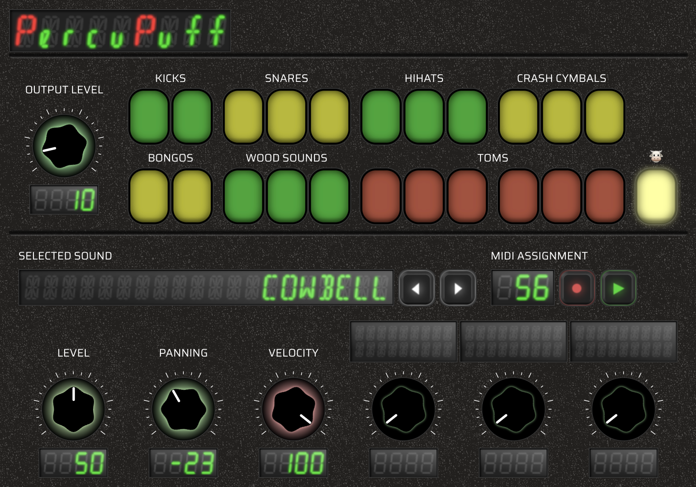

# Percupuff

Percupuff is a drum synthesizer written in [Cmajor](https://cmajor.dev/) with a TypeScript/React user interface. It aims to create semi-realistic drum sounds using a wide variety of audio synthesis techniques, inspired by various articles (such as [this one](https://www.soundonsound.com/techniques/synthesizing-cowbells-claves)) and other sources.

Thanks to the Cmajor tooling, this project can be compiled as a plugin to run in a DAW[†](#glossary) (such as [Reaper](https://www.reaper.fm/)) as a [CLAP](https://cleveraudio.org/)[†](#glossary) or VST3[†](#glossary) plugin, as a standalone executable or as a WebAssembly[†](#glossary).

To control the synthesizer MIDI[†](#glossary) input is typically used. It can be played real time with a MIDI controller[†](#glossary), or through a sequencer[†](#glossary) in a DAW. Ideally at some point the web version will also be playable through PC keyboard, mouse, touch, etc. for a lower bar of entry and more fun.

This project aims to prioritize an "educational angle" over things like performance or ultra realistic sound. The hope is that it can serve as an introduction to this kind of "audio programming" and enable experimentation and collaboration.

## State of the Project

The project is currently not finished. Not all sounds and features have been implemented yet. Contributions are welcome (@TODO: contribution guidelines and the like).

## Demo / Web Version

(@TODO: to be added).

## Building and Running

The easiest way to get started is to use VSCode (or a similar IDE) with the [Cmajor Tools extension](https://marketplace.visualstudio.com/items?itemName=CmajorSoftware.cmajor-tools). Please see the [Cmajor Getting Started instructions](https://cmajor.dev/docs/GettingStarted).

### Prerequisites

- VSCode
- [Cmajor Tools extension](https://marketplace.visualstudio.com/items?itemName=CmajorSoftware.cmajor-tools)
- Node.js and npm

### Building the view

The view needs to be built before you can run the project or build/export it as a plugin or WebAssembly.

- `cd` into `view`
- Install dependencies `npm install`
- `npm run build`

This will create `view/dist` which will contain:

- The built view
- An `index.js` file that functions as the glue between the Cmajor code and the view.

### Running

In VSCode with the Cmajor Tools installed:

- Open `percupuff.cmajorpatch`
- Open the Command Palete:
  - Command+Shift+P (on Mac) or
  - Ctrl+Shift+P (on Windows/Linux)
- Select `Cmajor: Run patch`.

### Development

Cmajor makes this pretty easy and straight forward, but there are a few gotchas in this project to be aware of:

- The Cmajor[†](#glossary)/DSP[†](#glossary) code hot reloads:

  - While having `Cmajor: Run patch` open make changes to any cmajor file, save them and they will be applied right away.

- The TypeScript/React/View code does **NOT** currently hot reload:

  - It might be possible to develop the view independently with `npm run dev` as expected with vite, with hot reloading in the browser, but this does not work with `Cmajor: Run patch`.
  - In `percupuff.cmajorpatch` we refer to `view/dist/index.js` specifically.
  - You have to run `npm run build` in the `view` folder to apply the changes and see them in the `Cmajor: Run patch` pane.
  - This also applies to any other Cmajor related tooling such as `Cmajor: Export patch as...`. **Always build the view first.**

- Parameters are defined in `view/src/params.ts`:

  - This project uses a LOT of parameters.
  - To reduce duplicated work `view/src/params.ts` is considered the source of truth.
  - Parameters are also defined in `dsp/Params.cmajor`, do not manually edit them here.
  - Instead use `npm run build-params` from the `view` folder.
    - Currently you have to manually paste its output into `dsp/Params.cmajor`. This should be made easier at some point.

- Some parameters are grouped (skip this for now if it's confusing).

  - Some of the sound processors (the files under `dsp/drums`) can create multiple sounds.
  - Parameters such as level, panning and velocity currently apply to the whole group.
  - For examples please see:

    - `view/src/params.ts`, specifically the `paramToEndpointId` and `endpointIdToParams` functions.
    - `view/src/commands/ParamBuilder.ts` `getConsolidatedParams`

## Glossary

**Audio Plugin:**
Audio plugins are little programs that can run inside of a DAW or other creative music software. They can be things like synthesizers, sound effects, visualizers and others.

**Audio Programming:**
Audio programming usually refer to programming things like synthesizers, audio effects or other music related software. You usually work down at the individual sample level to generate or manipulate sound in real time.

**Cmajor:**
A modern programming language and framework designed specifically for audio programming and plugin development. Cmajor provides tools for creating audio plugins, standalone applications, and WebAssembly modules with a focus on real-time audio processing and cross-platform deployment.

**CLAP (CLever Audio Plugin):**
CLAP is a modern open-source standard for audio plugins.

**DAW (Digital Audio Workstation):**  
A software application for recording, editing, mixing, and producing audio files. DAWs provide a graphical interface for arranging audio and MIDI tracks, applying effects, and managing virtual instruments. Examples include Reaper, Bitwig, and FL Studio.

**DSP (Digital Signal Processing):**
Make or manipulate sound with numbers. In the context of this project it might refer to the code that's responsible for generating the drum sounds, listening to midi signals, determining which drum should sound when.

**General MIDI:**
A standard that ensures MIDI data triggers predictable instruments on different devices by defining which MIDI messages correspond to which instruments and parameters.

**MIDI (Musical Instrument Digital Interface):**
MIDI is a protocol that devices and software use to communicate "musical information". It describes things like which note to start/stop playing and how hard it was pressed or hit. MIDI enables real-time performance, automation, and the ability to record and edit musical data without storing actual audio.

**MIDI Controller:**
A hardware device (like a keyboard, drum pad, or knob panel) that sends MIDI data to control software instruments and effects.

**Sample:**
In real life audio is a continuous vibration. If you measure this vibration without a computer you get a kind of wave pattern with ups and downs. The computer can only work with specific numbers, so it has to measure this pattern a certain amount of times per second. Each individual measurement is called a sample.

**Sample Rate:**
The sample "measurements" per second. When recording, generating, processing or outputting sound we need to know how many samples should go in a second.

**Sequencer:**
A tool for programming and playing back musical patterns. They can be part of a DAW or stand-alone. You can use it to create drum beats, melodies, and other sequences that control synthesizers.

**VST3 (Virtual Studio Technology 3):**  
Another standard for audio plugins.

**WebAssembly (Wasm):**  
A binary instruction format for a stack-based virtual machine, enabling high-performance execution of code on web browsers and other platforms. WebAssembly allows audio plugins and other applications to run efficiently in web environments.

## General MIDI Percussion Key Map

General MIDI[†](#glossary) defines a standard for percussive sounds that assigns specific notes to specific percussive instruments. In MIDI each note has a number. 60, for example, represents a C note at a certain octave. The percussion map defines which note numbers trigger which drum sounds, so instead of playing a tone, you get a specific percussion instrument.

This project attempts to follow this standard. Below is a table showing the state of what is implemented so far. Some instruments exist in the UI, but have no actual implementation yet.

Contributions for instruments that are not yet included in the UI are definitely welcome. They do come with the added complexity of needing to rejiggle the UI, but that does not necessarily have to be done in the same PR.

| Note | Instrument         | Included in UI | Implemented | Source File                                  |
| ---- | ------------------ | -------------- | ----------- | -------------------------------------------- |
| 35   | Acoustic Bass Drum | ✅             | ✅          | [BassDrum.cmajor](dsp/drums/BassDrum.cmajor) |
| 36   | Electric Bass Drum | ✅             | ❌          | -                                            |
| 37   | Side Stick         | ❌             | ❌          | -                                            |
| 38   | Acoustic Snare     | ✅             | ✅          | [Snare.cmajor](dsp/drums/Snare.cmajor)       |
| 39   | Hand Clap          | ✅             | ✅          | [Clap.cmajor](dsp/drums/Clap.cmajor)         |
| 40   | Electric Snare     | ✅             | ❌          | -                                            |
| 41   | Low Floor Tom      | ✅             | ❌          | -                                            |
| 42   | Closed Hi-hat      | ✅             | ✅          | [Hihat.cmajor](dsp/drums/Hihat.cmajor)       |
| 43   | High Floor Tom     | ✅             | ❌          | -                                            |
| 44   | Pedal Hi-hat       | ✅             | ✅          | [Hihat.cmajor](dsp/drums/Hihat.cmajor)       |
| 45   | Low Tom            | ✅             | ❌          | -                                            |
| 46   | Open Hi-hat        | ✅             | ✅          | [Hihat.cmajor](dsp/drums/Hihat.cmajor)       |
| 47   | Low-Mid Tom        | ✅             | ❌          | -                                            |
| 48   | High-Mid Tom       | ✅             | ❌          | -                                            |
| 49   | Crash Cymbal 1     | ✅             | ✅          | [Crash.cmajor](dsp/drums/Crash.cmajor)       |
| 50   | High Tom           | ✅             | ❌          | -                                            |
| 51   | Ride Cymbal 1      | ❌             | ❌          | -                                            |
| 52   | Chinese Cymbal     | ✅             | ✅          | [Crash.cmajor](dsp/drums/Crash.cmajor)       |
| 53   | Ride Bell          | ❌             | ❌          | -                                            |
| 54   | Tambourine         | ❌             | ❌          | -                                            |
| 55   | Splash Cymbal      | ❌             | ❌          | -                                            |
| 56   | Cowbell            | ✅             | ✅          | [Cowbell.cmajor](dsp/drums/Cowbell.cmajor)   |
| 57   | Crash Cymbal 2     | ✅             | ✅          | [Crash.cmajor](dsp/drums/Crash.cmajor)       |
| 58   | Vibraslap          | ❌             | ❌          | -                                            |
| 59   | Ride Cymbal 2      | ❌             | ❌          | -                                            |
| 60   | High Bongo         | ✅             | ✅          | [Bongos.cmajor](dsp/drums/Bongos.cmajor)     |
| 61   | Low Bongo          | ✅             | ✅          | [Bongos.cmajor](dsp/drums/Bongos.cmajor)     |
| 62   | Mute High Conga    | ❌             | ❌          | -                                            |
| 63   | Open High Conga    | ❌             | ❌          | -                                            |
| 64   | Low Conga          | ❌             | ❌          | -                                            |
| 65   | High Timbale       | ❌             | ❌          | -                                            |
| 66   | Low Timbale        | ❌             | ❌          | -                                            |
| 67   | High Agogô         | ❌             | ❌          | -                                            |
| 68   | Low Agogô          | ❌             | ❌          | -                                            |
| 69   | Cabasa             | ❌             | ❌          | -                                            |
| 70   | Maracas            | ❌             | ❌          | -                                            |
| 71   | Short Whistle      | ❌             | ❌          | -                                            |
| 72   | Long Whistle       | ❌             | ❌          | -                                            |
| 73   | Short Güiro        | ❌             | ❌          | -                                            |
| 74   | Long Güiro         | ❌             | ❌          | -                                            |
| 75   | Claves             | ✅             | ✅          | [Claves.cmajor](dsp/drums/Claves.cmajor)     |
| 76   | High Woodblock     | ✅             | ✅          | [Claves.cmajor](dsp/drums/Claves.cmajor)     |
| 77   | Low Woodblock      | ✅             | ✅          | [Claves.cmajor](dsp/drums/Claves.cmajor)     |
| 78   | Mute Cuíca         | ❌             | ❌          | -                                            |
| 79   | Open Cuíca         | ❌             | ❌          | -                                            |
| 80   | Mute Triangle      | ❌             | ❌          | -                                            |
| 81   | Open Triangle      | ❌             | ❌          | -                                            |

## Audio Programming / Synthesis

The goal of this section is to give a super quick overview of some of these topics. Most of these topics deserve a much more in depth description, but that can be overwhelming at first. If you're familiar with audio programming you will find nothing new here. If you're new to it, I hope this can serve as a placeholder in your brain until you're ready to dive deeper.

### Oscillators

An oscillator is a thing that generates a tone at a certain frequency. It outputs a kind of wave that goes up and down between -1 and 1, like a `~`. One complete iteration of this wave pattern is called a cycle. Frequency is a measurement of how many cycles fit in a second. A higher sound means more cycles per second, and traveling through each cycle quicker.

#### Phase

Phase describes where we are on the X axis of our waveform. To generate a sound we have to continuously move to the right on the X axis. The phase describes where we are, and the phase increment describes how much we are moving for each sample. A higher frequency means more cycles per second, so our phase increments become larger and we rush through our phase quicker.

#### Shape

An oscillator can generate wave forms in different shapes. The `~` shape is called a sine wave, and sounds very "pure" (or boring). A triangle wave looks more like `/\/` and sounds a little more interesting. A square wave `|‾|_|` and a saw tooth `/|/|` can sound a little abrasive.

A sine wave only generates the frequency of the note that it's being played at. This is called the fundamental frequency. These other shapes though, generate harmonics. Additional frequencies on top of the fundamental. Harmonics are related to the fundamental, so the note being played is still recognizable, it just sounds "fuller", "brighter" or "harsher".

#### Aliasing

When playing certain waveforms (like triangle or square waves) at high frequencies, you might hear unwanted sounds called aliasing artifacts. Computers can only represent sounds up to half the frequency of the sample rate (Nyquist theorem). If you try to generate sounds above that they get "mirrored" back. These mirrored sounds don't relate to the note being played, and can sound out of place and unwanted.

Normally we don't want to play notes so high that they're near this "Nyquist" frequency. The problem is the harmonics that some shapes generate. These can extend far beyond the fundamental frequency of a note.

PolyBLEP is a technique that can be used to create these waveforms safely, avoiding generating any harmonics that are too high for the computer to handle.

### Envelopes

An envelope changes a parameter over time. They are commonly used in combination with volume but can be used with any parameter, such as pitch or filter settings.

Envelopes come in different types:

- **Attack/Release** envelopes have two phases Attack and Release.
  - Attack describes how quickly we go from 0 to 100% (usually represented as 0.0 → 1.0).
  - Release describes the opposite, how long does it take for the note to fade out.
  - This is the type of envelope most commonly used in this project.
  - Normally between Attack and Release the value is kept at 100% while a note is held.
  - For our percussive sounds we usually go from Attack straight into Release instead.
- **ADSR** envelopes add two phases in between Attack and Release. These envelopes can build up to a peak and then hold at a configurable level. They are not currently used in this project but worth looking into. An example of why you would want this is a piano sound. There's an initial burst of sound as the hammer hits the string, while you hold the key the note keeps playing but at a lower level than what it started at, and finally it quickly dampens when you release the key.

#### Note on Attack

It might seem like we want an instant attack for percussive sounds and only really want to configure a custom release/decay/fade out. Ugly artifacts can occur in digital audio when jumping from silence to a sound instantly. To smooth out this transition we use the shortest attack setting that we can get away with.

### Filters

Filters change the frequency content of sounds. They can make sounds brighter, darker, or emphasize specific frequencies.

#### Low Pass Filter (LPF)

A low pass filter lets low frequencies through while gradually reducing higher frequencies above a cutoff point. This makes sounds darker. In this project, LPFs are often used with envelopes to create dynamic changes. For example, the bass drum starts bright and quickly darkens as the filter cutoff frequency drops.

##### Resonance

Some filters can add "resonance", emphasis of frequencies around the cutoff point. This can add character and re-introduce some of the brightness that was filtered out, or even over-compensate for a dramatic effect.

#### High Pass Filter (HPF)

A high pass filter does the opposite, it lets high frequencies through while reducing lower frequencies. This makes sounds brighter and removes unwanted low frequencies. Hi-hats, for example, use high pass filters to focus on their characteristic bright sound.

#### Notch Filter

A notch filter sharply reduces a narrow range of frequencies while leaving most other frequencies untouched. This can remove unwanted tones or change the character of a sound. The snare drum uses a notch filter to shape its tonal character.

### Wave Shaping

Wave shaping is an effect that distorts sounds. A waveshaper takes an input, applies a function to it, and outputs the result. The function determines what happens to the input. A common function is `tanh`. If you put in a sine wave, `tanh` will flatten its shape. Taken to the extreme, it can turn a sine wave `~` into a square wave `|‾|_|`.

This effect adds harmonics to the sound that weren't there before.

#### Wave Folding

Besides `tanh` other functions can be used. One that is used in a few places in this project is the `sin` function. Instead of flattening, this will fold the wave. The peaks will start to point inward. Here's a crude example:

`⋅.˳˳˳.⋅ॱ˙˙˙ॱ⋅.` → `⋅.˳.˳.⋅ॱ˙ॱ˙ॱ⋅.`

### Types of Synthesis

A short intro to some of the methods used in this project.

#### Frequency Modulation

Frequency modulation can be used to continuously adjust the frequency of one oscillator (carrier), using the output of another (modulator). This is used to create more interesting sounds efficiently. It is usually implemented by adjusting the phase of the carrier, causing us to step slightly faster or slightly slower depending on the output of the modulator at the given time.

Whole synthesizers are designed around this concept.

#### Subtractive Synthesis

As mentioned, depending on the shape oscillators can output some pretty grating sounds. These sounds can be tamed with filters. Doing so is called subtractive synthesis. You start with one or a few oscillators outputting very rich sounds, and then you can darken them, lighten them, emphasize or cut frequencies.

Besides tones, subtractive synthesis can also be performed with noise as a source. This technique is used for the Bongos and Claves/Wood block sounds.

#### Additive Synthesis

Harmonics are what make sounds interesting. The techniques described previously add harmonics efficiently, but you have less control over them. You can also generate these harmonics yourself, by using more oscillators. This is called additive synthesis. This can be very inefficient if you need to add a lot of harmonics.

For this project additive synthesis is usually combined with another technique. A small number of fixed frequencies are generated, and then mixed with white noise, or a pair of oscillators that apply frequency modulation to create the full sound.

#### Other Forms

These are a few other techniques worthy of consideration. They are not yet used in this project, but definitely could be!

- **Karplus-Strong** is a technique that uses a delay line, a buffer that stores samples, and plays them back later, like an echo. Karplus-Strong uses feedback, meaning the output of the delay line is fed back into it. This is combined with very short delays to create a simple model of a string.
- **Modal Synthesis** Uses multiple filters to simulate how real objects vibrate. Each filter represents one of the natural frequencies of the object (like a drum or bell). This can create very realistic sounds, but is more complex than basic subtractive synthesis.
